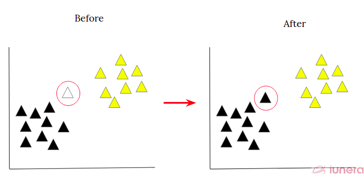
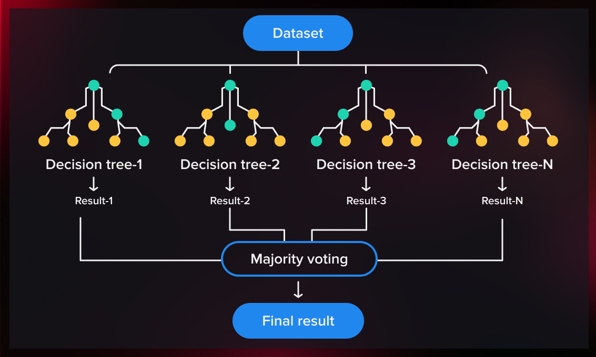
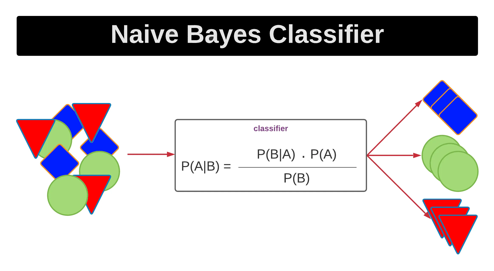
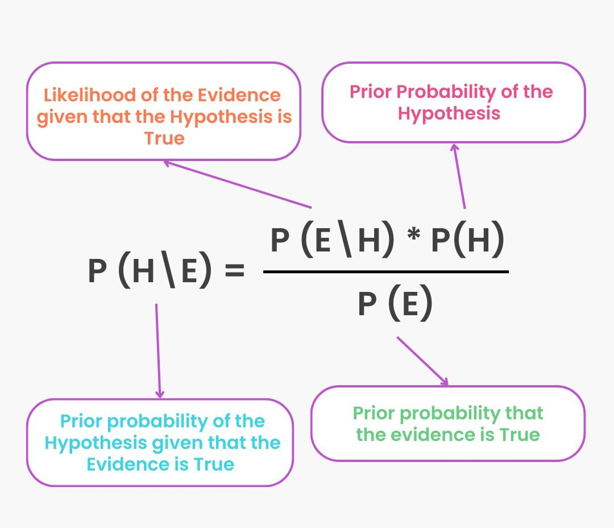

# Heart Disease Prediction

## A project that aims to predict the likelihood of a person having a heart disease, leveraging four machine learning models and determining the best performing algorithm.

This project uses four different classification algorithms— KNN, Decision Trees, Random Forest, and Naive Bayes— to predict the likelihood of a person having a heart disease based on 11 attributes that was determined to be the most common features among five different existing datasets. At the end of this project, the best performing algorithm was selected based on their precision and accuracy. The development of this project involved the following steps:

1. Importing the libraries
2. Exploring the dataset
3. Data Preprocessing
4. Exploratory Data Analysis
5. Model Training and Evaluation

## Model Interpretation
The following are the classification algorithms that were used in the project. I provided the context on how the models gain insights into the underlying patterns and factors driving the predictions, providing explanations for the model's decision-making process.

### KNN

*Caption: A visualization of how KNN classify a data point.*
([Image Source](https://www.iunera.com/kraken/fabric/k-nearest-neighbour-knn-algorithm/))

**Underlying Principle:** KNN relies on the assumption that similar instances are close to each other in the feature space. It measures similarity using distance metrics such as [Euclidean distance](https://en.wikipedia.org/wiki/Euclidean_distance) or [Manhattan distance](https://www.educative.io/answers/what-is-manhattan-distance-in-machine-learning).

**Decision-making Process:** KNN looks at the distances between the data points in the feature space. When a new data point is to be classified, KNN identifies the k-nearest neighbors in the training dataset. The class label is then determined by a majority vote among these neighbors.

### Decision Trees

*Caption: A visualization of how Decision Tree classify a data.*
([Image Source](https://medium.com/@shrutimisra/interpretable-ai-decision-trees-f9698e94ef9b))

**Underlying Principle:** Decision trees divides the feature space into regions and assign a class label to each region. It makes decisions by asking a series of questions based on features. The process continues until a stopping criterion is met, usually when a certain depth is reached.

**Decision-making Process:** The tree structure is traversed from the root to a leaf node. At each node, a decision is made based on a feature, leading to a specific branch. This process continues until a leaf node with a class label is reached.

### Random Forest

*Caption: A visualization of how Random Forest classify a data.*
([Image Source](https://serokell.io/blog/random-forest-classification))

**Underlying Principle:** Random Forest is an ensemble method that builds multiple decision trees and combines their predictions.

**Decision-making Process:** Each tree in the forest independently makes a decision. The final prediction is often the majority vote (classification) or average (regression) of the individual tree predictions.

### Naive Bayes

*Caption: A visualization of how Naive Bayes perform classification.*
([Image Source](https://innovationyourself.com/naive-bayes-classifier/))

*Caption: Formula of Naive Bayes*
([Image Source](https://www.turing.com/kb/an-introduction-to-naive-bayes-algorithm-for-beginners))

**Underlying Principle:** Naive Bayes is based on Bayes' theorem, which calculates the probability of a hypothesis given the observed evidence. It assumes that features are conditionally independent given the class label, simplifying the computation of probabilities.

**Decision-making Process:** To classify a new instance, Naive Bayes calculates the probability of each class given the observed features using Bayes' theorem. The class with the highest probability is assigned as the prediction.